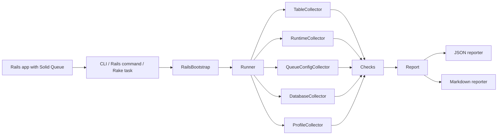

# Architecture

SolidLens is a causal diagnostic toolkit for Solid Queue. It reads Rails runtime, Solid Queue configuration, queue database, table state, and optional query-plan evidence, then turns that evidence into deterministic reports for CI and incident/debugging workflows.

The architecture is intentionally a narrow evidence pipeline:



## Command Boundary

SolidLens exposes three diagnostic commands:

- `doctor`: current-state readiness and pathology checks.
- `profile`: bounded temporal sampling for backlog, lag, semaphore, claimed-execution, and bloat growth.
- `explain`: adapter-aware query-plan evidence for queue polling, dispatch, blocked-job release, and wildcard queue discovery paths.

The standalone CLI is the canonical execution path. Rails commands and Rake tasks funnel into the same behavior so format validation, `--output`, Rails bootstrapping, and `--fail-on-high` remain consistent across entrypoints.

## Bootstrap Boundary

`SolidLens::RailsBootstrap` is responsible for app discovery and Rails boot. The CLI can:

- auto-detect a Rails app by walking up from the current directory;
- run against an explicit `--app-root`;
- set `RAILS_ENV` and `RACK_ENV` with `--rails-env`;
- skip boot when a test or embedding environment already loaded Rails.

This keeps collectors focused on evidence, not process boot concerns.

## Evidence Boundary

Collectors gather facts and do not decide severity:

- `RuntimeCollector`: Rails, Ruby, Solid Queue, and adapter runtime evidence.
- `QueueConfigCollector`: static and runtime Solid Queue topology evidence.
- `DatabaseCollector`: connection and database adapter evidence.
- `TableCollector`: Solid Queue schema, indexes, backlog, maintenance, recurring, bloat, and explain evidence.
- `ProfileCollector`: repeated bounded snapshots plus profile deltas and peaks.

Collectors are allowed to report evidence collection failures as data. They should not hide failures by returning a green-looking partial report.

## Check Boundary

Checks convert evidence into `Finding` objects:

```ruby
Finding.new(
  id: "solid_queue.pool.undersized",
  severity: :high,
  title: "Queue database pool is undersized",
  evidence: {
    worker_threads: 10,
    queue_db_pool: 10,
    reserved_connections: 2,
    safe_worker_threads: 8
  },
  recommendation: "Increase the queue DB pool to >= 12 or reduce worker threads to <= 8."
)
```

The check contract is:

1. consume collected evidence;
2. emit stable finding ids;
3. include the concrete evidence that justifies the finding;
4. recommend an operator action;
5. avoid mutating Solid Queue tables, Rails config, or application code.

## Report Boundary

`SolidLens::Report` owns command metadata, evidence, findings, severity summary, and exit status. Reporters render the same report as:

- JSON for CI, automation, and cheap-model consumption;
- Markdown for incident notes and human debugging.

Exit behavior is deliberately conservative: commands exit zero by default and only return non-zero when `--fail-on-high` is explicitly requested and high or critical findings exist.

## Contract Boundary

The public contract is larger than the Ruby classes alone:

- command names: `doctor`, `profile`, and `explain`;
- stable finding ids;
- the JSON report shape;
- the packaged product-direction note in `docs/specs/product-direction.md`.

`docs/contract-versioning.md` defines when those surfaces can change without a
major release.

## Packaging Boundary

`SolidLens::PackageAudit` verifies that the built gem:

- ships the README, product-direction note, and contract-versioning note;
- keeps public docs free of absolute local paths;
- can be consumed from Bundler as packaged gem contents instead of falling back
  to the checkout;
- executes both the standalone CLI and the Rails command inside a disposable
  Rails host app.

## Adapter Boundary

SolidLens supports adapter-specific evidence where the database meaning is different:

- SQLite uses `EXPLAIN QUERY PLAN`.
- PostgreSQL uses `EXPLAIN (FORMAT JSON)` and `pg_stat_user_tables` bloat evidence.
- MySQL, MariaDB, and compatible adapters use tabular `EXPLAIN`.

Adapter-specific behavior belongs in collectors/analyzers, while checks consume normalized evidence wherever possible.

## Non-Goals

- No dashboard, admin UI, or background daemon.
- No generic Active Job monitoring.
- No Solid Cache or Solid Cable diagnostics in the current product boundary.
- No table repair, migration generation, or automatic mutation.
- No vanity metrics without a concrete Solid Queue operator action.
